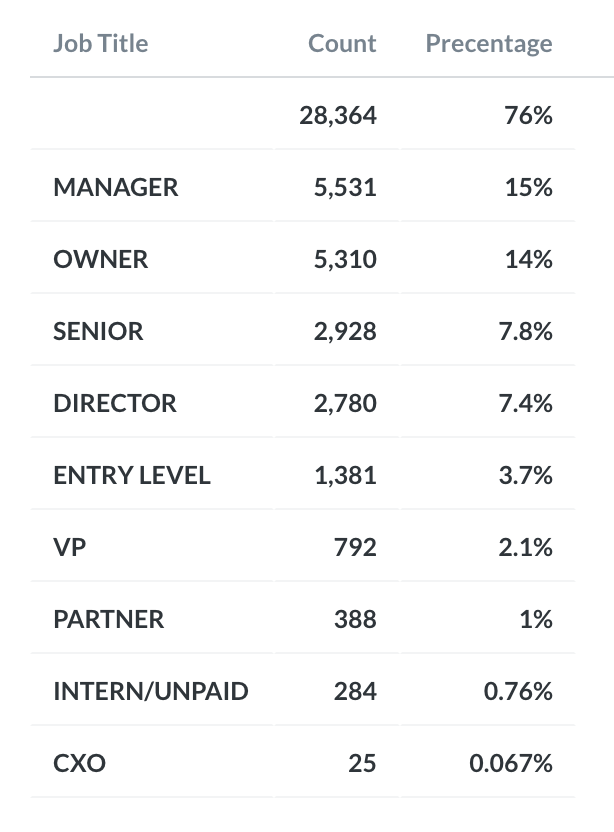
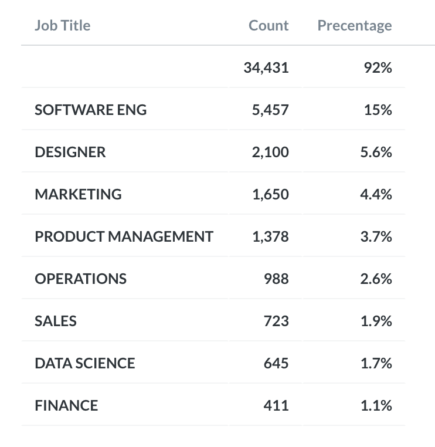

# OiT_Member_Data

Overview: One of the projects I was tasked to do during my time with Out in Tech was to bring to light the top levels and roles of Out in Tech members from the provided data set. In doing so I used SQL and Metabase to manipulate the data and calculated the percentages. While creating the queries, I kept in mind the variations of words the user could have inputted in Eventbrite to reflect their position. For example, someone that holds a Senior level position could have typed in their information incorrectly or in a form of an abbreviation. I also took into account the different scenarios where the phrase might be located. 

Here is an overview of Out in Tech's members levels:

Here is an overview of Out in Tech's members roles:

